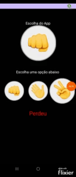

# Jokenpo App 🧱✂️📄

Este é um aplicativo Android simples desenvolvido para fins educacionais.O famoso jogo Pedra, Papel e Tesoura.

## Funcionalidades

- Gera aleatoriamente os movimentos do jogo (pedra, papel ou tesoura).
- Interface do usuário fácil e intuitiva.

## Tecnologias Utilizadas

- Kotlin
- Android Studio

## Uso

Para usar este aplicativo:

1. Clone este repositório.
2. Abra o projeto no Android Studio.
3. Compile e execute o aplicativo em um emulador ou dispositivo físico.

## Capturas de Tela

_(Adicione capturas de tela aqui)_

## Contribuições

Contribuições são bem-vindas! Este projeto é destinado a fins educacionais. Sinta-se à vontade para fazer um fork do repositório e enviar suas solicitações pull (pull requests).

## Licença

Este projeto está licenciado sob a [Licença MIT](LICENSE).
